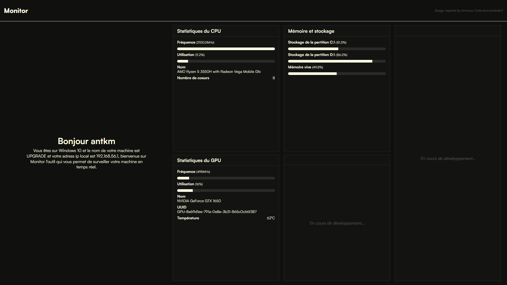

# python-ak-part3

> Créer un script python qui va récupérer les informations systèmes (voir les packages 'platform', 'cpuinfo', 'socket' et 'os' pour plus d'info)
> Avec le moteur de templating jinja, afficher dans un beau template HTML (avec du CSS dans un fichier CSS séparé) ces informations systèmes
> Évidemment, le tout en POO...
> 
> ⚠️ Je demande pas le site de l'année, mais faites un effort sur le CSS svp

## Installation

```bash
pip install -r requirements.txt
```

## Lancez le script

```bash
python flask --app app --debug run
```

## Améliorations

- [ ] Rafraichissement des données grace à Flask
- [ ] Ajout de données sur le matériel (webcam, micro, etc...)

## Demo

